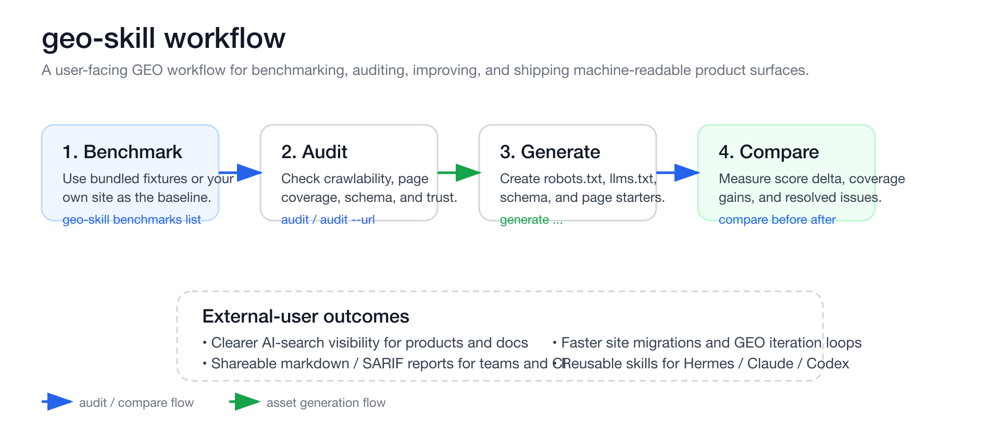

# geo-skill

[](https://github.com/vespid-ai/geo-skill)
[](https://vespid.ai/projects/geo-skill/)
[](https://vespid.ai)
[](https://github.com/vespid-ai/geo-skill/releases/tag/v0.5.0)
[](./LICENSE)

English | [简体中文](./README.zh-CN.md) | [日本語](./README.ja.md) | [Español](./README.es.md)

`geo-skill` is an open-source GEO toolkit for teams that want their product, docs, pricing, FAQ, and changelog to be easier to discover and cite across AI search surfaces such as ChatGPT Search, Bing-connected answer engines, and ByteDance / Bytespider workflows.

It gives you two things:

1. a practical Python CLI for auditing GEO readiness and generating core machine-readable assets
2. reusable agent skills for Hermes Agent, Claude Code, and Codex

This repository is for external users who want to improve real-world AI-search discoverability — not just read internal notes about GEO.

[Quick start](#quick-start) · [30-second use cases](#30-second-use-cases) · [What you can do](#what-you-can-do-with-geo-skill) · [CLI commands](#cli-commands) · [Built-in benchmarks](#built-in-benchmark-fixtures)

## Who this is for

- AI product teams that need clearer machine-readable product pages
- docs-first or API-first products that want stronger answer-engine coverage
- open-source projects that want their README, docs, and releases to be easier to cite
- agent builders who want reusable GEO workflows inside Hermes, Claude Code, or Codex

## What you can do with geo-skill

With `geo-skill`, you can:

- audit a public site or local static export for GEO readiness
- generate starter files like `robots.txt`, `llms.txt`, and JSON-LD schema
- compare before/after audit results for migrations or content upgrades
- export markdown or SARIF reports for human review and CI pipelines
- install reusable GEO skills into supported agent environments
- benchmark your site against bundled fixture sites with weak vs stronger GEO patterns

## Why teams use it

Most GEO advice is still too vague to execute. Teams are told to “write for AI search”, but the real work is operational:

- crawler allow / deny policy
- sitemap and URL hygiene
- product fact clarity
- FAQ and docs coverage
- pricing clarity
- trust and entity pages
- changelog freshness
- structured data
- machine-readable content layout
- OSS repository discoverability

`geo-skill` turns those ideas into repeatable checks and generation workflows.

## Quick start

```bash
python -m venv .venv
source .venv/bin/activate
pip install -e .
geo-skill skills list
```

## 30-second use cases

- You launched a new docs site and want to see whether pricing, docs, FAQ, and trust pages are actually visible to AI search workflows.
- You migrated URLs and need a before/after GEO compare report for the team.
- You want a quick way to generate `llms.txt`, `robots.txt`, and schema starters before polishing content by hand.
- You want your agent to run repeatable GEO checks instead of manually reviewing every page.

## Workflow at a glance



## Example workflows

Audit a local build:

```bash
geo-skill audit ./public
```

Audit a live site and save a markdown review:

```bash
geo-skill audit --url https://example.com --format markdown > geo-audit.md
```

Generate starter discovery assets:

```bash
geo-skill generate robots --domain https://example.com
geo-skill generate llms --project "Example" --summary "AI workflow product" --url https://example.com
geo-skill generate schema software-application --name "Example" --url https://example.com --summary "AI workflow product"
```

Compare before/after GEO reports:

```bash
geo-skill compare before.json after.json --format markdown > geo-diff.md
```

## Agent compatibility

### Hermes Agent

Hermes skills are stored in `skills/hermes/<skill-name>/SKILL.md` and can be installed into `~/.hermes/skills/geo/`.

### Claude Code

Claude-ready skills are stored in `.claude/skills/*.md` and can be installed into `~/.claude/skills/`.

### Codex

Codex-ready skills are stored in `.agents/skills/<skill-name>/SKILL.md` and follow OpenAI Codex skill conventions.

## CLI commands

```bash
geo-skill skills list
geo-skill skills show openai-chatgpt-search --agent hermes
geo-skill install --agent codex --all
geo-skill install --agent claude --skill geo-site-readiness
geo-skill benchmarks list
geo-skill audit ./site
geo-skill audit --url https://example.com
geo-skill audit ./site --format json
geo-skill audit ./site --format markdown
geo-skill audit ./site --format sarif
geo-skill compare before.json after.json
geo-skill compare before.json after.json --format markdown
geo-skill generate robots --domain https://example.com
geo-skill generate llms --project GeoSkill --summary "Open-source GEO skill pack" --url https://example.com
geo-skill generate schema software-application --name "Geo Skill" --url https://example.com --summary "Operational GEO toolkit"
geo-skill generate schema product --name "Geo Skill Cloud" --url https://example.com/product --summary "Managed GEO workflow platform" --brand "vespid-ai" --price 99
geo-skill generate schema organization --name "vespid-ai" --url https://vespid.ai --description "Agent infrastructure and GEO tooling" --same-as https://github.com/vespid-ai
geo-skill generate schema website --name "Geo Skill" --url https://example.com --description "Operational GEO toolkit" --search-url-template "https://example.com/search?q={search_term_string}"
geo-skill generate schema breadcrumb --item "Home::https://example.com" --item "Docs::https://example.com/docs"
geo-skill generate page-outline homepage --project "Geo Skill" --audience "AI product teams" --summary "Operational GEO toolkit"
geo-skill generate page-template feature --project "Geo Skill" --feature "Live URL Audit" --audience "AI product teams" --summary "Audit public pages for GEO readiness"
```

## Built-in benchmark fixtures

Use `geo-skill benchmarks list` to inspect bundled examples:

- `weak-marketing-site` — thin marketing surface with weak crawl and support coverage
- `docs-strong-site` — stronger docs / pricing / changelog benchmark with solid GEO hygiene
- `oss-release-site` — OSS-oriented benchmark for release, docs, and repository-linked discovery flows

These benchmarks are available both in the repository and in packaged installs.

## Built-in GEO skills

### Search-surface skills

- `openai-chatgpt-search`
- `doubao-bytespider`
- `geo-bing-webmaster-foundation`
- `geo-site-readiness`
- `geo-structured-data-software-sites`

### Content and page-modeling skills

- `geo-content-modeling`
- `geo-homepage-positioning`
- `geo-feature-pages`
- `geo-pricing-pages`
- `geo-faq-coverage`
- `geo-docs-help-center`
- `geo-changelog-freshness`
- `geo-comparison-pages`
- `geo-trust-and-entity-pages`

### Distribution and repo skills

- `geo-oss-repo-geo`
- `geo-launch-distribution`

### Expansion skills

- `geo-multilingual-localization`
- `geo-api-docs-geo`
- `geo-case-studies-social-proof`
- `geo-site-migration-url-stability`

## Repository layout

```text
.agents/skills/          Codex-ready skills
.claude/skills/          Claude-ready skills
benchmarks/              Human-readable benchmark fixtures for the repo
skills/hermes/           Hermes-ready skills
src/geo_skill/           CLI implementation
src/geo_skill/data/      Packaged benchmark data for installed builds
tests/                   unit tests
docs/plans/              implementation plans
```

## Design principles

- no external runtime dependencies
- CLI stays easy to call from agents and scripts
- README stays readable for external users, not only maintainers
- OpenAI GEO and ByteDance GEO are treated as distinct discovery surfaces
- useful page archetypes are first-class GEO work, not SEO leftovers
- machine-readable product facts matter more than slogan-heavy copy

## Roadmap

### P0

- richer page-type heuristics for multilingual and multi-product sites
- benchmark fixture expansion for more regional and docs-heavy archetypes
- compare thresholds or quality gates for CI enforcement

### P1

- repo-scoped installer helpers for Codex and Claude skill locations
- optional plugin packaging for Codex distribution
- benchmark packs for localized and API-first sites

### P2

- more agent-specific skill variants and packaging helpers
- sitemap index crawling for very large sites
- opt-in remote concurrency for large live audits

## Contributing

Issues and pull requests are welcome. If you add new GEO workflows, try to keep:

- README examples user-facing and concrete
- benchmark fixtures readable in GitHub
- CLI output stable for scripts and agents
- agent skill variants aligned across Hermes / Claude / Codex where relevant

## License

MIT
